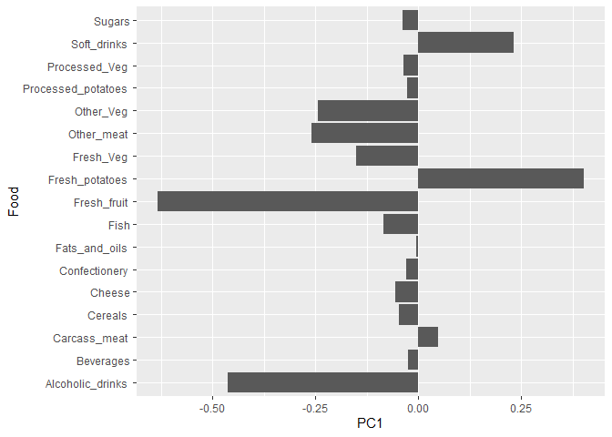
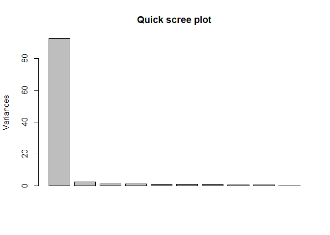

# Lab 7: PCA
Nicholas Chiu
2024-02-03

## Data Import, Q1

``` r
url <- "https://tinyurl.com/UK-foods"
x <- read.csv(url)
dim(x)
```

    [1] 17  5

Using the dim function, we see there are 17 rows and 5 columns.

## Checking Data, Q2

``` r
# Preview first 6 rows
#head(x)

# Solution 1
#rownames(x) <- x[,1]
#x <- x[,-1]
#head(x)

#dim(x)

# Solution 2
x <- read.csv(url, row.names=1)
head(x)
```

                   England Wales Scotland N.Ireland
    Cheese             105   103      103        66
    Carcass_meat       245   227      242       267
    Other_meat         685   803      750       586
    Fish               147   160      122        93
    Fats_and_oils      193   235      184       209
    Sugars             156   175      147       139

``` r
dim(x)
```

    [1] 17  4

``` r
#x
```

The second approach is more robust and efficient since it solves the
problem in 1 line of code. Additionally, running the first solution
multiple times will continuously make the data frame dimensions smaller
as it sets the first column as the row names.

## Spotting major differences and trends, Q3/Q5/Q6

``` r
# Q3
barplot(as.matrix(x), beside=F, col=rainbow(nrow(x)))
```


``` r
# Q5
pairs(x, col=rainbow(10), pch=16)
```


Q3: Changing the optional argument ‘beside’ to false results in the
desired plot.

Q5: If a point lies on the diagonal of a given pairwise plot, it means
that the variable the point represents is very correlated between the
two countries (equal consumption).

Q6: The main differences between N. Ireland and other UK countries is
that seems that they have equal or less consumption on average for
almost every category of food. The one outlier is fresh potatoes, which
N. Ireland consumes far more than the other 3 countries on average.

## PCA, Q7/Q8/Q9

``` r
# Use the prcomp() PCA function 
pca <- prcomp( t(x) )
summary(pca)
```

    Importance of components:
                                PC1      PC2      PC3       PC4
    Standard deviation     324.1502 212.7478 73.87622 3.176e-14
    Proportion of Variance   0.6744   0.2905  0.03503 0.000e+00
    Cumulative Proportion    0.6744   0.9650  1.00000 1.000e+00

``` r
# Q7: Plot PC1 vs PC2
plot(pca$x[,1], pca$x[,2], xlab="PC1", ylab="PC2", xlim=c(-270,500))
text(pca$x[,1], pca$x[,2], colnames(x))
```


``` r
# Q8: Customize plot
column_colors <- c("orange", "red", "blue", "green")
plot(pca$x[,1], pca$x[,2], xlab="PC1", ylab="PC2",xlim=c(-270,500))
text(pca$x[,1], pca$x[,2], colnames(x), col = column_colors)
```


``` r
v <- round( pca$sdev^2/sum(pca$sdev^2) * 100 )
v
```

    [1] 67 29  4  0

``` r
z <- summary(pca)
z$importance
```

                                 PC1       PC2      PC3          PC4
    Standard deviation     324.15019 212.74780 73.87622 3.175833e-14
    Proportion of Variance   0.67444   0.29052  0.03503 0.000000e+00
    Cumulative Proportion    0.67444   0.96497  1.00000 1.000000e+00

``` r
barplot(v, xlab="Principal Component", ylab="Percent Variation")
```


``` r
# Lets focus on PC1 as it accounts for > 90% of variance 
par(mar=c(10, 3, 0.35, 0))
barplot( pca$rotation[,1], las=2 )
```


``` r
# PCA2
par(mar=c(10, 3, 0.35, 0))
barplot( pca$rotation[,2], las=2 )
```


Q9: Fresh potatoes and soft drinks are prominent features on the loading
plot. PC2 tells us that fresh potatoes push countries down while soft
drinks push countries up.

## ggplot

``` r
library(ggplot2)

df <- as.data.frame(pca$x)
df_lab <- tibble::rownames_to_column(df, "Country")

# Our first basic plot
ggplot(df_lab) + 
  aes(PC1, PC2, col=Country) + 
  geom_point()
```


``` r
ggplot(df_lab) + 
  aes(PC1, PC2, col=Country, label=Country) + 
  geom_hline(yintercept = 0, col="gray") +
  geom_vline(xintercept = 0, col="gray") +
  geom_point(show.legend = FALSE) +
  geom_label(hjust=1, nudge_x = -10, show.legend = FALSE) +
  expand_limits(y = c(-300,500)) +
  xlab("PC1 (67.4%)") +
  ylab("PC2 (28%)") +
  theme_bw()
```


``` r
ld <- as.data.frame(pca$rotation)
ld_lab <- tibble::rownames_to_column(ld, "Food")

ggplot(ld_lab) +
  aes(PC1, Food) +
  geom_col() 
```



``` r
ggplot(ld_lab) +
  aes(PC1, reorder(Food, PC1), bg=PC1) +
  geom_col() + 
  xlab("PC1 Loadings/Contributions") +
  ylab("Food Group") +
  scale_fill_gradient2(low="purple", mid="gray", high="darkgreen", guide=NULL) +
  theme_bw()
```


``` r
biplot(pca)
```


# PCA of RNA-seq Data, Q10

``` r
url2 <- "https://tinyurl.com/expression-CSV"
rna.data <- read.csv(url2, row.names=1)
head(rna.data)
```

           wt1 wt2  wt3  wt4 wt5 ko1 ko2 ko3 ko4 ko5
    gene1  439 458  408  429 420  90  88  86  90  93
    gene2  219 200  204  210 187 427 423 434 433 426
    gene3 1006 989 1030 1017 973 252 237 238 226 210
    gene4  783 792  829  856 760 849 856 835 885 894
    gene5  181 249  204  244 225 277 305 272 270 279
    gene6  460 502  491  491 493 612 594 577 618 638

``` r
dim(rna.data)
```

    [1] 100  10

Q10: There are 100 genes and 10 samples in the data.

``` r
# Again we have to take the transpose of our data 
pca <- prcomp(t(rna.data), scale=TRUE)
 
# Simple un polished plot of pc1 and pc2
plot(pca$x[,1], pca$x[,2], xlab="PC1", ylab="PC2")
```


``` r
summary(pca)
```

    Importance of components:
                              PC1    PC2     PC3     PC4     PC5     PC6     PC7
    Standard deviation     9.6237 1.5198 1.05787 1.05203 0.88062 0.82545 0.80111
    Proportion of Variance 0.9262 0.0231 0.01119 0.01107 0.00775 0.00681 0.00642
    Cumulative Proportion  0.9262 0.9493 0.96045 0.97152 0.97928 0.98609 0.99251
                               PC8     PC9      PC10
    Standard deviation     0.62065 0.60342 3.457e-15
    Proportion of Variance 0.00385 0.00364 0.000e+00
    Cumulative Proportion  0.99636 1.00000 1.000e+00

``` r
plot(pca, main="Quick scree plot")
```



``` r
# Variance captured per PC 
pca.var <- pca$sdev^2

# Percent variance is often more informative to look at 
pca.var.per <- round(pca.var/sum(pca.var)*100, 1)
pca.var.per
```

     [1] 92.6  2.3  1.1  1.1  0.8  0.7  0.6  0.4  0.4  0.0

``` r
barplot(pca.var.per, main="Scree Plot", 
        names.arg = paste0("PC", 1:10),
        xlab="Principal Component", ylab="Percent Variation")
```


``` r
# A vector of colors for wt and ko samples
colvec <- colnames(rna.data)
colvec[grep("wt", colvec)] <- "red"
colvec[grep("ko", colvec)] <- "blue"

plot(pca$x[,1], pca$x[,2], col=colvec, pch=16,
     xlab=paste0("PC1 (", pca.var.per[1], "%)"),
     ylab=paste0("PC2 (", pca.var.per[2], "%)"))

text(pca$x[,1], pca$x[,2], labels = colnames(rna.data), pos=c(rep(4,5), rep(2,5)))
```


``` r
library(ggplot2)

df <- as.data.frame(pca$x)

# Our first basic plot
ggplot(df) + 
  aes(PC1, PC2) + 
  geom_point()
```


``` r
# Add a 'wt' and 'ko' "condition" column
df$samples <- colnames(rna.data) 
df$condition <- substr(colnames(rna.data),1,2)

p <- ggplot(df) + 
        aes(PC1, PC2, label=samples, col=condition) + 
        geom_label(show.legend = FALSE)
p
```


``` r
p + labs(title="PCA of RNASeq Data",
       subtitle = "PC1 clealy seperates wild-type from knock-out samples",
       x=paste0("PC1 (", pca.var.per[1], "%)"),
       y=paste0("PC2 (", pca.var.per[2], "%)"),
       caption="Class example data") +
     theme_bw()
```


Gene Loadings

``` r
loading_scores <- pca$rotation[,1]

# Find the top 10 measurements (genes) that contribute
# most to PC1 in either direction (+ or -)
gene_scores <- abs(loading_scores) 
gene_score_ranked <- sort(gene_scores, decreasing=TRUE)

# show the names of the top 10 genes
top_10_genes <- names(gene_score_ranked[1:10])
top_10_genes 
```

     [1] "gene100" "gene66"  "gene45"  "gene68"  "gene98"  "gene60"  "gene21" 
     [8] "gene56"  "gene10"  "gene90" 
