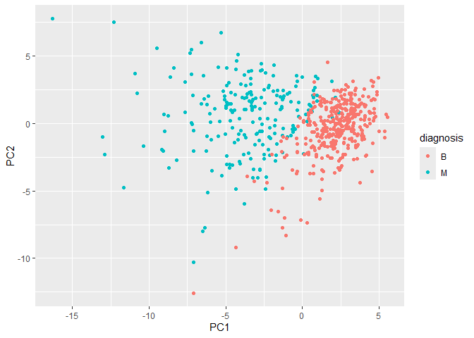

# Mini-Project: Unsupervised Learning Analysis of Human Breast Cancer
Cells
Nicholas Chiu

## 1. EDA

``` r
## Data Prep
fna.data <- "WisconsinCancer.csv"

## Input the data and store as wisc.df
wisc.df <- read.csv(fna.data, row.names=1)

#wisc.df
diagnosis <- factor(wisc.df[,1]) 

wisc.data <- wisc.df[,-1]

## EDA
#wisc.data

malignant <- diagnosis[diagnosis == "M"]
length(malignant)
```

    [1] 212

``` r
columns <- colnames(wisc.data)
columns
```

     [1] "radius_mean"             "texture_mean"           
     [3] "perimeter_mean"          "area_mean"              
     [5] "smoothness_mean"         "compactness_mean"       
     [7] "concavity_mean"          "concave.points_mean"    
     [9] "symmetry_mean"           "fractal_dimension_mean" 
    [11] "radius_se"               "texture_se"             
    [13] "perimeter_se"            "area_se"                
    [15] "smoothness_se"           "compactness_se"         
    [17] "concavity_se"            "concave.points_se"      
    [19] "symmetry_se"             "fractal_dimension_se"   
    [21] "radius_worst"            "texture_worst"          
    [23] "perimeter_worst"         "area_worst"             
    [25] "smoothness_worst"        "compactness_worst"      
    [27] "concavity_worst"         "concave.points_worst"   
    [29] "symmetry_worst"          "fractal_dimension_worst"

``` r
grep("_mean", columns)
```

     [1]  1  2  3  4  5  6  7  8  9 10

Q1: There are 569 observations in the dataset

Q2: There are 212 observations with a malignant diagnosis

Q3: There are 10 columns (variables) with the suffix “\_mean”

## PCA

``` r
## Performing PCA
colMeans(wisc.data)
```

                radius_mean            texture_mean          perimeter_mean 
               1.412729e+01            1.928965e+01            9.196903e+01 
                  area_mean         smoothness_mean        compactness_mean 
               6.548891e+02            9.636028e-02            1.043410e-01 
             concavity_mean     concave.points_mean           symmetry_mean 
               8.879932e-02            4.891915e-02            1.811619e-01 
     fractal_dimension_mean               radius_se              texture_se 
               6.279761e-02            4.051721e-01            1.216853e+00 
               perimeter_se                 area_se           smoothness_se 
               2.866059e+00            4.033708e+01            7.040979e-03 
             compactness_se            concavity_se       concave.points_se 
               2.547814e-02            3.189372e-02            1.179614e-02 
                symmetry_se    fractal_dimension_se            radius_worst 
               2.054230e-02            3.794904e-03            1.626919e+01 
              texture_worst         perimeter_worst              area_worst 
               2.567722e+01            1.072612e+02            8.805831e+02 
           smoothness_worst       compactness_worst         concavity_worst 
               1.323686e-01            2.542650e-01            2.721885e-01 
       concave.points_worst          symmetry_worst fractal_dimension_worst 
               1.146062e-01            2.900756e-01            8.394582e-02 

``` r
apply(wisc.data,2,sd)
```

                radius_mean            texture_mean          perimeter_mean 
               3.524049e+00            4.301036e+00            2.429898e+01 
                  area_mean         smoothness_mean        compactness_mean 
               3.519141e+02            1.406413e-02            5.281276e-02 
             concavity_mean     concave.points_mean           symmetry_mean 
               7.971981e-02            3.880284e-02            2.741428e-02 
     fractal_dimension_mean               radius_se              texture_se 
               7.060363e-03            2.773127e-01            5.516484e-01 
               perimeter_se                 area_se           smoothness_se 
               2.021855e+00            4.549101e+01            3.002518e-03 
             compactness_se            concavity_se       concave.points_se 
               1.790818e-02            3.018606e-02            6.170285e-03 
                symmetry_se    fractal_dimension_se            radius_worst 
               8.266372e-03            2.646071e-03            4.833242e+00 
              texture_worst         perimeter_worst              area_worst 
               6.146258e+00            3.360254e+01            5.693570e+02 
           smoothness_worst       compactness_worst         concavity_worst 
               2.283243e-02            1.573365e-01            2.086243e-01 
       concave.points_worst          symmetry_worst fractal_dimension_worst 
               6.573234e-02            6.186747e-02            1.806127e-02 

``` r
wisc.pr <- prcomp(wisc.data, scale=TRUE)

summary(wisc.pr)
```

    Importance of components:
                              PC1    PC2     PC3     PC4     PC5     PC6     PC7
    Standard deviation     3.6444 2.3857 1.67867 1.40735 1.28403 1.09880 0.82172
    Proportion of Variance 0.4427 0.1897 0.09393 0.06602 0.05496 0.04025 0.02251
    Cumulative Proportion  0.4427 0.6324 0.72636 0.79239 0.84734 0.88759 0.91010
                               PC8    PC9    PC10   PC11    PC12    PC13    PC14
    Standard deviation     0.69037 0.6457 0.59219 0.5421 0.51104 0.49128 0.39624
    Proportion of Variance 0.01589 0.0139 0.01169 0.0098 0.00871 0.00805 0.00523
    Cumulative Proportion  0.92598 0.9399 0.95157 0.9614 0.97007 0.97812 0.98335
                              PC15    PC16    PC17    PC18    PC19    PC20   PC21
    Standard deviation     0.30681 0.28260 0.24372 0.22939 0.22244 0.17652 0.1731
    Proportion of Variance 0.00314 0.00266 0.00198 0.00175 0.00165 0.00104 0.0010
    Cumulative Proportion  0.98649 0.98915 0.99113 0.99288 0.99453 0.99557 0.9966
                              PC22    PC23   PC24    PC25    PC26    PC27    PC28
    Standard deviation     0.16565 0.15602 0.1344 0.12442 0.09043 0.08307 0.03987
    Proportion of Variance 0.00091 0.00081 0.0006 0.00052 0.00027 0.00023 0.00005
    Cumulative Proportion  0.99749 0.99830 0.9989 0.99942 0.99969 0.99992 0.99997
                              PC29    PC30
    Standard deviation     0.02736 0.01153
    Proportion of Variance 0.00002 0.00000
    Cumulative Proportion  1.00000 1.00000

Q4: 44.27%

Q5: 3 (PC1, PC2, PC3 is 73% of variation)

Q6: 7 (PC1:7 is 91% of variation)

``` r
## Interpreting PCA results

biplot(wisc.pr)
```


``` r
# Scatter plot observations by components 1 and 2
plot(wisc.pr$x[,1:2], col = diagnosis, xlab = "PC1", ylab = "PC2")
```


``` r
# Scatter plot observations by components 1 and 3
plot(wisc.pr$x[,c(1,3)], col = diagnosis, xlab = "PC1", ylab = "PC3")
```


Q7: There are many vectors pointing in the same direction. The plot is
very difficult to understand because there are too many variables and
observations that make the plot very messy.

Q8: Both plots have 2 distinct subgroups but plot 2 has more overlap
between the subgroups compared to plot 1.

``` r
## ggplot
# Create a data.frame for ggplot
df <- as.data.frame(wisc.pr$x)
df$diagnosis <- diagnosis

# Load the ggplot2 package
library(ggplot2)

# Make a scatter plot colored by diagnosis
ggplot(df) + 
  aes(PC1, PC2, col=diagnosis) + 
  geom_point()
```



``` r
## Variance

pr.var <- wisc.pr$sdev^2
head(pr.var)
```

    [1] 13.281608  5.691355  2.817949  1.980640  1.648731  1.207357

``` r
# Variance explained by each principal component: pve
pve <- pr.var / sum(pr.var)

# Plot variance explained for each principal component
plot(pve, xlab = "Principal Component", 
     ylab = "Proportion of Variance Explained", 
     ylim = c(0, 1), type = "o")
```


``` r
# Alternative scree plot of the same data, note data driven y-axis
barplot(pve, ylab = "Precent of Variance Explained",
     names.arg=paste0("PC",1:length(pve)), las=2, axes = FALSE)
axis(2, at=pve, labels=round(pve,2)*100 )
```


``` r
## ggplot based graph
#install.packages("factoextra")
library(factoextra)
```

    Welcome! Want to learn more? See two factoextra-related books at https://goo.gl/ve3WBa

``` r
fviz_eig(wisc.pr, addlabels = TRUE)
```


``` r
## Communicating PCA Results

wisc.pr$rotation["concave.points_mean",1]
```

    [1] -0.2608538

``` r
head(pve)
```

    [1] 0.44272026 0.18971182 0.09393163 0.06602135 0.05495768 0.04024522

``` r
sum(pve[1:5])
```

    [1] 0.8473427

Q9: -0.261

Q10: 5 PCs

## 3. Hierarchical Clustering

``` r
## Data manipulation

data.scaled <- scale(wisc.data)

data.dist <- dist(data.scaled)

wisc.hclust <- hclust(data.dist, method="complete")

plot(wisc.hclust)
abline(h=19, col="red", lty=2)
```


Q11: height = 19

``` r
## Selecting number of clusters

wisc.hclust.clusters <- cutree(wisc.hclust,k=4)
plot(wisc.hclust.clusters)
```


``` r
table(wisc.hclust.clusters, diagnosis)
```

                        diagnosis
    wisc.hclust.clusters   B   M
                       1  12 165
                       2   2   5
                       3 343  40
                       4   0   2

``` r
wisc.hclust.clust <- cutree(wisc.hclust,k=8)
table(wisc.hclust.clust, diagnosis)
```

                     diagnosis
    wisc.hclust.clust   B   M
                    1  12  86
                    2   0  79
                    3   0   3
                    4 331  39
                    5   2   0
                    6  12   1
                    7   0   2
                    8   0   2

Q12: Using 8 clusters appears to produce a better cluster vs. diagnoses
match because there are more distinct clusters that that correspond to
diagnoses.

``` r
## Other methods
wisc.hclust <- hclust(data.dist, method="ward.D2")
plot(wisc.hclust)
```


``` r
wisc.hclust.c <- cutree(wisc.hclust,k=4)
plot(wisc.hclust.c)
```


``` r
table(wisc.hclust.c, diagnosis)
```

                 diagnosis
    wisc.hclust.c   B   M
                1   0 115
                2   6  48
                3 337  48
                4  14   1

Q13: The “ward.D2” method produces my favorite results because the plot
produces clear cluster levels and the table produces the most number of
clusters that correspond to one of the diagnoses.

## 4. K-means Clustering – Optional (skipped)

## 5. Combining Methods

``` r
## Clustering
wisc.pr.hclust <- hclust(dist(wisc.pr$x[,1:7]), method="ward.D2")

plot(wisc.pr.hclust)
```


``` r
grps <- cutree(wisc.pr.hclust, k=2)
table(grps)
```

    grps
      1   2 
    216 353 

``` r
table(grps, diagnosis)
```

        diagnosis
    grps   B   M
       1  28 188
       2 329  24

``` r
plot(wisc.pr$x[,1:2], col=grps)
```


``` r
plot(wisc.pr$x[,1:2], col=diagnosis)
```


``` r
g <- as.factor(grps)
levels(g)
```

    [1] "1" "2"

``` r
g <- relevel(g,2)
levels(g)
```

    [1] "2" "1"

``` r
plot(wisc.pr$x[,1:2], col=g)
```


``` r
wisc.pr.hclust <- hclust(dist(wisc.pr$x[, 1:7]), method="ward.D2")

wisc.pr.hclust.clusters <- cutree(wisc.pr.hclust, k=2)

table(wisc.pr.hclust.clusters, diagnosis)
```

                           diagnosis
    wisc.pr.hclust.clusters   B   M
                          1  28 188
                          2 329  24

``` r
#wisc.hclust.clusters2 <- cutree(wisc.hclust, k=2)

table(wisc.hclust.clusters, diagnosis)
```

                        diagnosis
    wisc.hclust.clusters   B   M
                       1  12 165
                       2   2   5
                       3 343  40
                       4   0   2

Q15: It does well

Q16: The other clustering models do well in separating the clusters as
well but yield slightly different results from the new model.

## 6. Sensitivity/Specificity

``` r
## Sensitivity
newmodelSen <- 188/(188+28)
kmeansSen <- 175/(175+14)
hclustSen <- 165/(165+12)

newmodelSen
```

    [1] 0.8703704

``` r
kmeansSen
```

    [1] 0.9259259

``` r
hclustSen
```

    [1] 0.9322034

``` r
## Specificity
newmodelSpec <- 329/(329+24)
kmeansSpec <- 343/(343+37)
hclustSpec <- 343/(343+40)

newmodelSpec
```

    [1] 0.9320113

``` r
kmeansSpec
```

    [1] 0.9026316

``` r
hclustSpec
```

    [1] 0.8955614

Q17: The original hclust model does best for sensitivity and the new
hclust model does best for specificity.

## 7. Prediction

``` r
#url <- "new_samples.csv"
url <- "https://tinyurl.com/new-samples-CSV"
new <- read.csv(url)
npc <- predict(wisc.pr, newdata=new)
npc
```

               PC1       PC2        PC3        PC4       PC5        PC6        PC7
    [1,]  2.576616 -3.135913  1.3990492 -0.7631950  2.781648 -0.8150185 -0.3959098
    [2,] -4.754928 -3.009033 -0.1660946 -0.6052952 -1.140698 -1.2189945  0.8193031
                PC8       PC9       PC10      PC11      PC12      PC13     PC14
    [1,] -0.2307350 0.1029569 -0.9272861 0.3411457  0.375921 0.1610764 1.187882
    [2,] -0.3307423 0.5281896 -0.4855301 0.7173233 -1.185917 0.5893856 0.303029
              PC15       PC16        PC17        PC18        PC19       PC20
    [1,] 0.3216974 -0.1743616 -0.07875393 -0.11207028 -0.08802955 -0.2495216
    [2,] 0.1299153  0.1448061 -0.40509706  0.06565549  0.25591230 -0.4289500
               PC21       PC22       PC23       PC24        PC25         PC26
    [1,]  0.1228233 0.09358453 0.08347651  0.1223396  0.02124121  0.078884581
    [2,] -0.1224776 0.01732146 0.06316631 -0.2338618 -0.20755948 -0.009833238
                 PC27        PC28         PC29         PC30
    [1,]  0.220199544 -0.02946023 -0.015620933  0.005269029
    [2,] -0.001134152  0.09638361  0.002795349 -0.019015820

``` r
plot(wisc.pr$x[,1:2], col=g)
points(npc[,1], npc[,2], col="blue", pch=16, cex=3)
text(npc[,1], npc[,2], c(1,2), col="white")
```


Q18: Based on the results, we should prioritize patient 2.
