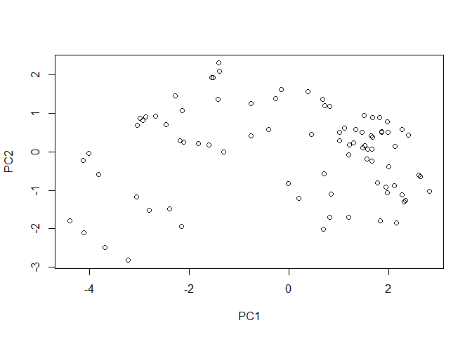

# Lab 10: Halloween Mini-Project
Nicholas Chiu

## 1. Importing Candy Data

                 chocolate fruity caramel peanutyalmondy nougat crispedricewafer
    100 Grand            1      0       1              0      0                1
    3 Musketeers         1      0       0              0      1                0
    One dime             0      0       0              0      0                0
    One quarter          0      0       0              0      0                0
    Air Heads            0      1       0              0      0                0
    Almond Joy           1      0       0              1      0                0
                 hard bar pluribus sugarpercent pricepercent winpercent
    100 Grand       0   1        0        0.732        0.860   66.97173
    3 Musketeers    0   1        0        0.604        0.511   67.60294
    One dime        0   0        0        0.011        0.116   32.26109
    One quarter     0   0        0        0.011        0.511   46.11650
    Air Heads       0   0        0        0.906        0.511   52.34146
    Almond Joy      0   1        0        0.465        0.767   50.34755

``` r
## Finding the number of different candies in the dataset
nrow(candy)
```

    [1] 85

``` r
sum(candy$fruity)
```

    [1] 38

Q1: 85 different candy types

Q2: 38 fruity candy types

## 2. Favorite Candy

``` r
## Winpercent analysis for different candy types
#candy
candy["Welch's Fruit Snacks", ]$winpercent
```

    [1] 44.37552

``` r
candy["Kit Kat", ]$winpercent
```

    [1] 76.7686

``` r
candy["Tootsie Roll Snack Bars", ]$winpercent
```

    [1] 49.6535

Q3: My favorite candy in the dataset is Welch’s Fruit Snacks and it has
a winpercent value of 44.37

Q4: The winpercent value for “Kit Kat” is 76.77

Q5: The winpercent value for “Tootsie Roll Snack Bars” is 49.65.

``` r
## Using the skimr package
#install.packages("skimr")
library("skimr")
skim(candy)
```

|                                                  |       |
|:-------------------------------------------------|:------|
| Name                                             | candy |
| Number of rows                                   | 85    |
| Number of columns                                | 12    |
| \_\_\_\_\_\_\_\_\_\_\_\_\_\_\_\_\_\_\_\_\_\_\_   |       |
| Column type frequency:                           |       |
| numeric                                          | 12    |
| \_\_\_\_\_\_\_\_\_\_\_\_\_\_\_\_\_\_\_\_\_\_\_\_ |       |
| Group variables                                  | None  |

Data summary

**Variable type: numeric**

| skim_variable    | n_missing | complete_rate |  mean |    sd |    p0 |   p25 |   p50 |   p75 |  p100 | hist  |
|:------------|-------:|----------:|-----:|-----:|-----:|-----:|-----:|-----:|-----:|:-----|
| chocolate        |         0 |             1 |  0.44 |  0.50 |  0.00 |  0.00 |  0.00 |  1.00 |  1.00 | ▇▁▁▁▆ |
| fruity           |         0 |             1 |  0.45 |  0.50 |  0.00 |  0.00 |  0.00 |  1.00 |  1.00 | ▇▁▁▁▆ |
| caramel          |         0 |             1 |  0.16 |  0.37 |  0.00 |  0.00 |  0.00 |  0.00 |  1.00 | ▇▁▁▁▂ |
| peanutyalmondy   |         0 |             1 |  0.16 |  0.37 |  0.00 |  0.00 |  0.00 |  0.00 |  1.00 | ▇▁▁▁▂ |
| nougat           |         0 |             1 |  0.08 |  0.28 |  0.00 |  0.00 |  0.00 |  0.00 |  1.00 | ▇▁▁▁▁ |
| crispedricewafer |         0 |             1 |  0.08 |  0.28 |  0.00 |  0.00 |  0.00 |  0.00 |  1.00 | ▇▁▁▁▁ |
| hard             |         0 |             1 |  0.18 |  0.38 |  0.00 |  0.00 |  0.00 |  0.00 |  1.00 | ▇▁▁▁▂ |
| bar              |         0 |             1 |  0.25 |  0.43 |  0.00 |  0.00 |  0.00 |  0.00 |  1.00 | ▇▁▁▁▂ |
| pluribus         |         0 |             1 |  0.52 |  0.50 |  0.00 |  0.00 |  1.00 |  1.00 |  1.00 | ▇▁▁▁▇ |
| sugarpercent     |         0 |             1 |  0.48 |  0.28 |  0.01 |  0.22 |  0.47 |  0.73 |  0.99 | ▇▇▇▇▆ |
| pricepercent     |         0 |             1 |  0.47 |  0.29 |  0.01 |  0.26 |  0.47 |  0.65 |  0.98 | ▇▇▇▇▆ |
| winpercent       |         0 |             1 | 50.32 | 14.71 | 22.45 | 39.14 | 47.83 | 59.86 | 84.18 | ▃▇▆▅▂ |

Q6: Sugarpercent, pricepercent, and winpercent look to be on a 0-1
continuous scale while all of the other variables are exclusively 0 or
1.

Q7: A zero and one for the candy$chocolate column indicate whether or
not the candy is or contains chocolate. If it does, it is a 1, otherwise
it is 0. Therefore, it cannot be a continous scale.

``` r
## Plotting histogram
win <- candy$winpercent
hist(win, main = "Candy Dataset Winpercent", xlim=c(0,100))
```


``` r
boxplot(win)
```


``` r
median(win)
```

    [1] 47.82975

``` r
## t-test
mean(candy$winpercent[as.logical(candy$chocolate)])
```

    [1] 60.92153

``` r
mean(candy$winpercent[as.logical(candy$fruity)])
```

    [1] 44.11974

``` r
chocoWin <- candy$winpercent[as.logical(candy$chocolate)]
fruityWin <- candy$winpercent[as.logical(candy$fruity)]

t.test(chocoWin, fruityWin)
```


        Welch Two Sample t-test

    data:  chocoWin and fruityWin
    t = 6.2582, df = 68.882, p-value = 2.871e-08
    alternative hypothesis: true difference in means is not equal to 0
    95 percent confidence interval:
     11.44563 22.15795
    sample estimates:
    mean of x mean of y 
     60.92153  44.11974 

Q8: Code above

Q9: The distribution of winpercent is slightly right skewed.

Q10: The center of the distribution (median) is below 50%

Q11: On average, chocolate candy is higher ranked than fruit candy

Q12: Because the p value of 2.9E-8 is much less than the alpha of 0.05,
there is a statistically significant difference between the winpercent
of chocolate and fruity candies.

## 3. Overall Candy Rankings

``` r
## More EDA
library(dplyr)
```


    Attaching package: 'dplyr'

    The following objects are masked from 'package:stats':

        filter, lag

    The following objects are masked from 'package:base':

        intersect, setdiff, setequal, union

``` r
candy %>% arrange(winpercent) %>% head(5)
```

                       chocolate fruity caramel peanutyalmondy nougat
    Nik L Nip                  0      1       0              0      0
    Boston Baked Beans         0      0       0              1      0
    Chiclets                   0      1       0              0      0
    Super Bubble               0      1       0              0      0
    Jawbusters                 0      1       0              0      0
                       crispedricewafer hard bar pluribus sugarpercent pricepercent
    Nik L Nip                         0    0   0        1        0.197        0.976
    Boston Baked Beans                0    0   0        1        0.313        0.511
    Chiclets                          0    0   0        1        0.046        0.325
    Super Bubble                      0    0   0        0        0.162        0.116
    Jawbusters                        0    1   0        1        0.093        0.511
                       winpercent
    Nik L Nip            22.44534
    Boston Baked Beans   23.41782
    Chiclets             24.52499
    Super Bubble         27.30386
    Jawbusters           28.12744

``` r
candy %>% arrange(desc(winpercent)) %>% head(5)
```

                              chocolate fruity caramel peanutyalmondy nougat
    Reese's Peanut Butter cup         1      0       0              1      0
    Reese's Miniatures                1      0       0              1      0
    Twix                              1      0       1              0      0
    Kit Kat                           1      0       0              0      0
    Snickers                          1      0       1              1      1
                              crispedricewafer hard bar pluribus sugarpercent
    Reese's Peanut Butter cup                0    0   0        0        0.720
    Reese's Miniatures                       0    0   0        0        0.034
    Twix                                     1    0   1        0        0.546
    Kit Kat                                  1    0   1        0        0.313
    Snickers                                 0    0   1        0        0.546
                              pricepercent winpercent
    Reese's Peanut Butter cup        0.651   84.18029
    Reese's Miniatures               0.279   81.86626
    Twix                             0.906   81.64291
    Kit Kat                          0.511   76.76860
    Snickers                         0.651   76.67378

Q13: The 5 least liked candy types are Nik L Nip, Boston Baked Beans,
Chiclets, Super Bubble, and Jawbusters.

Q14: The 5 most popular candy types are Reece’s Reanut Butter Cups,
Reece’s Mini, Tix, Kit Kat, and Snickers.

``` r
## Using ggplot
library(ggplot2)

# Plot 1
ggplot(candy) + 
  aes(winpercent, rownames(candy)) +
  geom_col()
```


``` r
# Plot 2: Reorder
ggplot(candy) + 
  aes(winpercent, reorder(rownames(candy),winpercent)) +
  geom_col()
```


``` r
# Plot 3: Add color
# colors different from example due to color blindness
my_cols=rep("black", nrow(candy))
my_cols[as.logical(candy$chocolate)] = "blue"
my_cols[as.logical(candy$bar)] = "yellow"
my_cols[as.logical(candy$fruity)] = "red"


ggplot(candy) + 
  aes(winpercent, reorder(rownames(candy),winpercent)) +
  geom_col(fill=my_cols) 
```


Q17: The worst ranked chocolate candy is Sixlets

Q18: The best ranked fruit candy is Starburst.

## 4. Looking at Pricepercent

``` r
#install.packages("ggrepel")
library(ggrepel)

# How about a plot of price vs win
ggplot(candy) +
  aes(winpercent, pricepercent, label=rownames(candy)) +
  geom_point(col=my_cols) + 
  geom_text_repel(col=my_cols, size=3.3, max.overlaps = 5)
```

    Warning: ggrepel: 54 unlabeled data points (too many overlaps). Consider
    increasing max.overlaps


``` r
ord0 <- order(candy$winpercent, decreasing = T)
head( candy[ord0,c(11,12)], n=5 )
```

                              pricepercent winpercent
    Reese's Peanut Butter cup        0.651   84.18029
    Reese's Miniatures               0.279   81.86626
    Twix                             0.906   81.64291
    Kit Kat                          0.511   76.76860
    Snickers                         0.651   76.67378

``` r
ord <- order(candy$pricepercent, decreasing = TRUE)
head( candy[ord,c(11,12)], n=5 )
```

                             pricepercent winpercent
    Nik L Nip                       0.976   22.44534
    Nestle Smarties                 0.976   37.88719
    Ring pop                        0.965   35.29076
    Hershey's Krackel               0.918   62.28448
    Hershey's Milk Chocolate        0.918   56.49050

Q19: Based on the scatterplot, fruit candies are overall the cheapest
type of candy for the best win percentage but chocolate candies are also
good.

Q20: The most expensive 5 candies are Nik L Nip, Nestle Smarties, Ring
pop, Hersheys Krackel, and Hersheys Milk Chocolate. Among these, Nik L
Nip is the least popular.

Q21: Lollipop plot below

``` r
ggplot(candy) +
  aes(pricepercent, reorder(rownames(candy), pricepercent)) +
  geom_segment(aes(yend = reorder(rownames(candy), pricepercent), 
                   xend = 0), col="gray40") +
    geom_point()
```


## Exploring Correlation Structure

``` r
#install.packages("corrplot")
library(corrplot)
```

    corrplot 0.92 loaded

``` r
cij <- cor(candy)
corrplot(cij)
```


Q22: Chocolate and fruity variables are anti-correlated

Q23: Winpercent and chocolate are most positively correlated

## PCA

``` r
## Performing PCA using prcomp function
pca <- prcomp(candy, scale=TRUE)
summary(pca)
```

    Importance of components:
                              PC1    PC2    PC3     PC4    PC5     PC6     PC7
    Standard deviation     2.0788 1.1378 1.1092 1.07533 0.9518 0.81923 0.81530
    Proportion of Variance 0.3601 0.1079 0.1025 0.09636 0.0755 0.05593 0.05539
    Cumulative Proportion  0.3601 0.4680 0.5705 0.66688 0.7424 0.79830 0.85369
                               PC8     PC9    PC10    PC11    PC12
    Standard deviation     0.74530 0.67824 0.62349 0.43974 0.39760
    Proportion of Variance 0.04629 0.03833 0.03239 0.01611 0.01317
    Cumulative Proportion  0.89998 0.93832 0.97071 0.98683 1.00000

``` r
plot(pca$x[,1:2])
```



``` r
plot(pca$x[,1:2], col=my_cols, pch=16)
```


``` r
## New dataframe
my_data <- cbind(candy, pca$x[,1:3])

p <- ggplot(my_data) + 
        aes(x=PC1, y=PC2, 
            size=winpercent/100,  
            text=rownames(my_data),
            label=rownames(my_data)) +
        geom_point(col=my_cols)

p
```


``` r
library(ggrepel)

p + geom_text_repel(size=3.3, col=my_cols, max.overlaps = 7)  + 
  theme(legend.position = "none") +
  labs(title="Halloween Candy PCA Space",
       subtitle="Colored by type: chocolate bar (dark brown), chocolate other (light brown), fruity (red), other (black)",
       caption="Data from 538")
```

    Warning: ggrepel: 43 unlabeled data points (too many overlaps). Consider
    increasing max.overlaps


``` r
#install.packages("plotly")
library(plotly)
```


    Attaching package: 'plotly'

    The following object is masked from 'package:ggplot2':

        last_plot

    The following object is masked from 'package:stats':

        filter

    The following object is masked from 'package:graphics':

        layout

``` r
#ggplotly(p)

par(mar=c(8,4,2,2))
barplot(pca$rotation[,1], las=2, ylab="PC1 Contribution")
```


Q24: Fruity, pluribus, and hard are picked up strongly by PC1 in the
positive direction. It makes sense because fruity candies usually come
in large numbers and are more likley to be hard candies compared to
chocolate.
