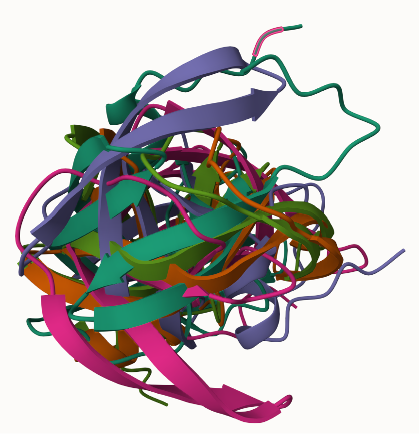
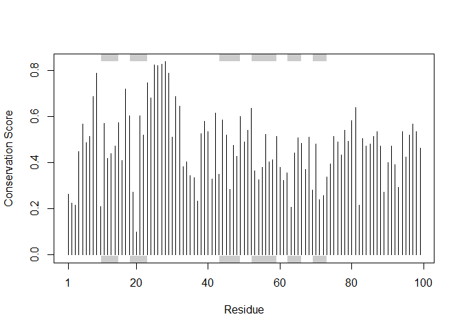

# Lab 11: Structural Bioinformatics 2
Nicholas Chiu

## Lab 10 Completion

Lab 10, including PCA, was submitted in full in the Lab 10 gradescope
assignment

# Alpha Fold

## 6. Generating your own structure predictions

Colabfold plots:


## 7. Interpreting Results




## 8.1 Custom analysis of resulting models

``` r
results_dir <- "hivprdimer_23119/" 


# File names for all PDB models
pdb_files <- list.files(path=results_dir, pattern="*.pdb", full.names = TRUE)

# Print our PDB file names
basename(pdb_files)
```

    [1] "hivprdimer_23119_unrelaxed_rank_001_alphafold2_multimer_v3_model_5_seed_000.pdb"
    [2] "hivprdimer_23119_unrelaxed_rank_002_alphafold2_multimer_v3_model_1_seed_000.pdb"
    [3] "hivprdimer_23119_unrelaxed_rank_003_alphafold2_multimer_v3_model_4_seed_000.pdb"
    [4] "hivprdimer_23119_unrelaxed_rank_004_alphafold2_multimer_v3_model_2_seed_000.pdb"
    [5] "hivprdimer_23119_unrelaxed_rank_005_alphafold2_multimer_v3_model_3_seed_000.pdb"

``` r
library(bio3d)

# Read all data from Models 
#  and superpose/fit coords
pdbs <- pdbaln(pdb_files, fit=TRUE, exefile="msa")
```

    Reading PDB files:
    hivprdimer_23119/hivprdimer_23119_unrelaxed_rank_001_alphafold2_multimer_v3_model_5_seed_000.pdb
    hivprdimer_23119/hivprdimer_23119_unrelaxed_rank_002_alphafold2_multimer_v3_model_1_seed_000.pdb
    hivprdimer_23119/hivprdimer_23119_unrelaxed_rank_003_alphafold2_multimer_v3_model_4_seed_000.pdb
    hivprdimer_23119/hivprdimer_23119_unrelaxed_rank_004_alphafold2_multimer_v3_model_2_seed_000.pdb
    hivprdimer_23119/hivprdimer_23119_unrelaxed_rank_005_alphafold2_multimer_v3_model_3_seed_000.pdb
    .....

    Extracting sequences

    pdb/seq: 1   name: hivprdimer_23119/hivprdimer_23119_unrelaxed_rank_001_alphafold2_multimer_v3_model_5_seed_000.pdb 
    pdb/seq: 2   name: hivprdimer_23119/hivprdimer_23119_unrelaxed_rank_002_alphafold2_multimer_v3_model_1_seed_000.pdb 
    pdb/seq: 3   name: hivprdimer_23119/hivprdimer_23119_unrelaxed_rank_003_alphafold2_multimer_v3_model_4_seed_000.pdb 
    pdb/seq: 4   name: hivprdimer_23119/hivprdimer_23119_unrelaxed_rank_004_alphafold2_multimer_v3_model_2_seed_000.pdb 
    pdb/seq: 5   name: hivprdimer_23119/hivprdimer_23119_unrelaxed_rank_005_alphafold2_multimer_v3_model_3_seed_000.pdb 

``` r
pdbs
```

                                   1        .         .         .         .         50 
    [Truncated_Name:1]hivprdimer   PQITLWQRPLVTIKIGGQLKEALLDTGADDTVLEEMSLPGRWKPKMIGGI
    [Truncated_Name:2]hivprdimer   PQITLWQRPLVTIKIGGQLKEALLDTGADDTVLEEMSLPGRWKPKMIGGI
    [Truncated_Name:3]hivprdimer   PQITLWQRPLVTIKIGGQLKEALLDTGADDTVLEEMSLPGRWKPKMIGGI
    [Truncated_Name:4]hivprdimer   PQITLWQRPLVTIKIGGQLKEALLDTGADDTVLEEMSLPGRWKPKMIGGI
    [Truncated_Name:5]hivprdimer   PQITLWQRPLVTIKIGGQLKEALLDTGADDTVLEEMSLPGRWKPKMIGGI
                                   ************************************************** 
                                   1        .         .         .         .         50 

                                  51        .         .         .         .         100 
    [Truncated_Name:1]hivprdimer   GGFIKVRQYDQILIEICGHKAIGTVLVGPTPVNIIGRNLLTQIGCTLNFP
    [Truncated_Name:2]hivprdimer   GGFIKVRQYDQILIEICGHKAIGTVLVGPTPVNIIGRNLLTQIGCTLNFP
    [Truncated_Name:3]hivprdimer   GGFIKVRQYDQILIEICGHKAIGTVLVGPTPVNIIGRNLLTQIGCTLNFP
    [Truncated_Name:4]hivprdimer   GGFIKVRQYDQILIEICGHKAIGTVLVGPTPVNIIGRNLLTQIGCTLNFP
    [Truncated_Name:5]hivprdimer   GGFIKVRQYDQILIEICGHKAIGTVLVGPTPVNIIGRNLLTQIGCTLNFP
                                   ************************************************** 
                                  51        .         .         .         .         100 

                                 101        .         .         .         .         150 
    [Truncated_Name:1]hivprdimer   QITLWQRPLVTIKIGGQLKEALLDTGADDTVLEEMSLPGRWKPKMIGGIG
    [Truncated_Name:2]hivprdimer   QITLWQRPLVTIKIGGQLKEALLDTGADDTVLEEMSLPGRWKPKMIGGIG
    [Truncated_Name:3]hivprdimer   QITLWQRPLVTIKIGGQLKEALLDTGADDTVLEEMSLPGRWKPKMIGGIG
    [Truncated_Name:4]hivprdimer   QITLWQRPLVTIKIGGQLKEALLDTGADDTVLEEMSLPGRWKPKMIGGIG
    [Truncated_Name:5]hivprdimer   QITLWQRPLVTIKIGGQLKEALLDTGADDTVLEEMSLPGRWKPKMIGGIG
                                   ************************************************** 
                                 101        .         .         .         .         150 

                                 151        .         .         .         .       198 
    [Truncated_Name:1]hivprdimer   GFIKVRQYDQILIEICGHKAIGTVLVGPTPVNIIGRNLLTQIGCTLNF
    [Truncated_Name:2]hivprdimer   GFIKVRQYDQILIEICGHKAIGTVLVGPTPVNIIGRNLLTQIGCTLNF
    [Truncated_Name:3]hivprdimer   GFIKVRQYDQILIEICGHKAIGTVLVGPTPVNIIGRNLLTQIGCTLNF
    [Truncated_Name:4]hivprdimer   GFIKVRQYDQILIEICGHKAIGTVLVGPTPVNIIGRNLLTQIGCTLNF
    [Truncated_Name:5]hivprdimer   GFIKVRQYDQILIEICGHKAIGTVLVGPTPVNIIGRNLLTQIGCTLNF
                                   ************************************************ 
                                 151        .         .         .         .       198 

    Call:
      pdbaln(files = pdb_files, fit = TRUE, exefile = "msa")

    Class:
      pdbs, fasta

    Alignment dimensions:
      5 sequence rows; 198 position columns (198 non-gap, 0 gap) 

    + attr: xyz, resno, b, chain, id, ali, resid, sse, call

``` r
rd <- rmsd(pdbs, fit=T)
```

    Warning in rmsd(pdbs, fit = T): No indices provided, using the 198 non NA positions

``` r
range(rd)
```

    [1]  0.000 14.507

``` r
#install.packages("pheatmap")
library(pheatmap)

colnames(rd) <- paste0("m",1:5)
rownames(rd) <- paste0("m",1:5)
pheatmap(rd)
```


``` r
pdb <- read.pdb("1hsg")
```

      Note: Accessing on-line PDB file

``` r
plotb3(pdbs$b[1,], typ="l", lwd=2, sse=pdb)
points(pdbs$b[2,], typ="l", col="red")
points(pdbs$b[3,], typ="l", col="blue")
points(pdbs$b[4,], typ="l", col="darkgreen")
points(pdbs$b[5,], typ="l", col="orange")
abline(v=100, col="gray")
```


``` r
core <- core.find(pdbs)
```

     core size 197 of 198  vol = 5017.583 
     core size 196 of 198  vol = 4299.462 
     core size 195 of 198  vol = 4030.786 
     core size 194 of 198  vol = 3797.241 
     core size 193 of 198  vol = 3567.126 
     core size 192 of 198  vol = 3378.469 
     core size 191 of 198  vol = 3249.342 
     core size 190 of 198  vol = 3149.254 
     core size 189 of 198  vol = 3070.29 
     core size 188 of 198  vol = 2993.999 
     core size 187 of 198  vol = 2917.618 
     core size 186 of 198  vol = 2865.321 
     core size 185 of 198  vol = 2835.031 
     core size 184 of 198  vol = 2825.584 
     core size 183 of 198  vol = 2833.979 
     core size 182 of 198  vol = 2894.691 
     core size 181 of 198  vol = 2975.843 
     core size 180 of 198  vol = 3026.495 
     core size 179 of 198  vol = 3070.895 
     core size 178 of 198  vol = 3121.204 
     core size 177 of 198  vol = 3127.656 
     core size 176 of 198  vol = 3102.311 
     core size 175 of 198  vol = 3060.45 
     core size 174 of 198  vol = 2993.84 
     core size 173 of 198  vol = 2902.747 
     core size 172 of 198  vol = 2841.824 
     core size 171 of 198  vol = 2771.39 
     core size 170 of 198  vol = 2708.164 
     core size 169 of 198  vol = 2616.115 
     core size 168 of 198  vol = 2540.663 
     core size 167 of 198  vol = 2471.823 
     core size 166 of 198  vol = 2396.567 
     core size 165 of 198  vol = 2324.756 
     core size 164 of 198  vol = 2258.532 
     core size 163 of 198  vol = 2189.811 
     core size 162 of 198  vol = 2118.531 
     core size 161 of 198  vol = 2048.541 
     core size 160 of 198  vol = 1964.22 
     core size 159 of 198  vol = 1878.019 
     core size 158 of 198  vol = 1802.026 
     core size 157 of 198  vol = 1719.543 
     core size 156 of 198  vol = 1640.479 
     core size 155 of 198  vol = 1561.746 
     core size 154 of 198  vol = 1490.107 
     core size 153 of 198  vol = 1416.211 
     core size 152 of 198  vol = 1345.494 
     core size 151 of 198  vol = 1287.606 
     core size 150 of 198  vol = 1225.523 
     core size 149 of 198  vol = 1168.6 
     core size 148 of 198  vol = 1123.809 
     core size 147 of 198  vol = 1069.607 
     core size 146 of 198  vol = 1028.33 
     core size 145 of 198  vol = 986.295 
     core size 144 of 198  vol = 947.191 
     core size 143 of 198  vol = 910.624 
     core size 142 of 198  vol = 868.922 
     core size 141 of 198  vol = 829.982 
     core size 140 of 198  vol = 788.548 
     core size 139 of 198  vol = 749.234 
     core size 138 of 198  vol = 713.554 
     core size 137 of 198  vol = 679.035 
     core size 136 of 198  vol = 639.012 
     core size 135 of 198  vol = 599.236 
     core size 134 of 198  vol = 556.226 
     core size 133 of 198  vol = 521.307 
     core size 132 of 198  vol = 484.526 
     core size 131 of 198  vol = 453.614 
     core size 130 of 198  vol = 422.947 
     core size 129 of 198  vol = 404.641 
     core size 128 of 198  vol = 397.064 
     core size 127 of 198  vol = 371.629 
     core size 126 of 198  vol = 355.609 
     core size 125 of 198  vol = 334.859 
     core size 124 of 198  vol = 313.691 
     core size 123 of 198  vol = 291.489 
     core size 122 of 198  vol = 268.734 
     core size 121 of 198  vol = 245.865 
     core size 120 of 198  vol = 236.559 
     core size 119 of 198  vol = 218.641 
     core size 118 of 198  vol = 201.313 
     core size 117 of 198  vol = 183.861 
     core size 116 of 198  vol = 167.249 
     core size 115 of 198  vol = 151.276 
     core size 114 of 198  vol = 137.843 
     core size 113 of 198  vol = 124.983 
     core size 112 of 198  vol = 112.07 
     core size 111 of 198  vol = 101.394 
     core size 110 of 198  vol = 91.994 
     core size 109 of 198  vol = 82.201 
     core size 108 of 198  vol = 74.644 
     core size 107 of 198  vol = 70.256 
     core size 106 of 198  vol = 64.859 
     core size 105 of 198  vol = 58.745 
     core size 104 of 198  vol = 54.966 
     core size 103 of 198  vol = 49.885 
     core size 102 of 198  vol = 45.389 
     core size 101 of 198  vol = 41.648 
     core size 100 of 198  vol = 38.714 
     core size 99 of 198  vol = 36.289 
     core size 98 of 198  vol = 33.698 
     core size 97 of 198  vol = 28.156 
     core size 96 of 198  vol = 23.583 
     core size 95 of 198  vol = 19.899 
     core size 94 of 198  vol = 16.637 
     core size 93 of 198  vol = 12.448 
     core size 92 of 198  vol = 9.42 
     core size 91 of 198  vol = 8.296 
     core size 90 of 198  vol = 5.783 
     core size 89 of 198  vol = 4.006 
     core size 88 of 198  vol = 2.903 
     core size 87 of 198  vol = 2.24 
     core size 86 of 198  vol = 1.765 
     core size 85 of 198  vol = 1.408 
     core size 84 of 198  vol = 1.164 
     core size 83 of 198  vol = 0.969 
     core size 82 of 198  vol = 0.833 
     core size 81 of 198  vol = 0.675 
     core size 80 of 198  vol = 0.579 
     core size 79 of 198  vol = 0.529 
     core size 78 of 198  vol = 0.456 
     FINISHED: Min vol ( 0.5 ) reached

``` r
core.inds <- print(core, vol=0.5)
```

    # 79 positions (cumulative volume <= 0.5 Angstrom^3) 
      start end length
    1    10  24     15
    2    27  48     22
    3    53  94     42

``` r
xyz <- pdbfit(pdbs, core.inds, outpath="corefit_structures")

rf <- rmsf(xyz)

plotb3(rf, sse=pdb)
abline(v=100, col="gray", ylab="RMSF")
```


## 8.2 Predicted Alignment Error for domains

``` r
#install.packages("jsonlite")

library(jsonlite)

# Listing of all PAE JSON files
pae_files <- list.files(path=results_dir,
                        pattern=".*model.*\\.json",
                        full.names = TRUE)

pae1 <- read_json(pae_files[1],simplifyVector = TRUE)
pae5 <- read_json(pae_files[5],simplifyVector = TRUE)

attributes(pae1)
```

    $names
    [1] "plddt"   "max_pae" "pae"     "ptm"     "iptm"   

``` r
# Per-residue pLDDT scores 
#  same as B-factor of PDB..
head(pae1$plddt) 
```

    [1] 87.69 93.19 94.69 94.38 95.50 89.56

``` r
pae1$max_pae
```

    [1] 15.89844

``` r
pae5$max_pae
```

    [1] 29.25

``` r
plot.dmat(pae1$pae, 
          xlab="Residue Position (i)",
          ylab="Residue Position (j)")
```


``` r
plot.dmat(pae5$pae, 
          xlab="Residue Position (i)",
          ylab="Residue Position (j)",
          grid.col = "black",
          zlim=c(0,30))
```


``` r
plot.dmat(pae1$pae, 
          xlab="Residue Position (i)",
          ylab="Residue Position (j)",
          grid.col = "black",
          zlim=c(0,30))
```


## 8.3 Residue conservation from alignment file

``` r
aln_file <- list.files(path=results_dir,
                       pattern=".a3m$",
                        full.names = TRUE)
aln_file
```

    [1] "hivprdimer_23119/hivprdimer_23119.a3m"

``` r
aln <- read.fasta(aln_file[1], to.upper = TRUE)
```

    [1] " ** Duplicated sequence id's: 101 **"
    [2] " ** Duplicated sequence id's: 101 **"

``` r
dim(aln$ali)
```

    [1] 5378  132

``` r
sim <- conserv(aln)

plotb3(sim[1:99], sse=trim.pdb(pdb, chain="A"),
       ylab="Conservation Score")
```



``` r
con <- consensus(aln, cutoff = 0.9)
con$seq
```

      [1] "-" "-" "-" "-" "-" "-" "-" "-" "-" "-" "-" "-" "-" "-" "-" "-" "-" "-"
     [19] "-" "-" "-" "-" "-" "-" "D" "T" "G" "A" "-" "-" "-" "-" "-" "-" "-" "-"
     [37] "-" "-" "-" "-" "-" "-" "-" "-" "-" "-" "-" "-" "-" "-" "-" "-" "-" "-"
     [55] "-" "-" "-" "-" "-" "-" "-" "-" "-" "-" "-" "-" "-" "-" "-" "-" "-" "-"
     [73] "-" "-" "-" "-" "-" "-" "-" "-" "-" "-" "-" "-" "-" "-" "-" "-" "-" "-"
     [91] "-" "-" "-" "-" "-" "-" "-" "-" "-" "-" "-" "-" "-" "-" "-" "-" "-" "-"
    [109] "-" "-" "-" "-" "-" "-" "-" "-" "-" "-" "-" "-" "-" "-" "-" "-" "-" "-"
    [127] "-" "-" "-" "-" "-" "-"

``` r
m1.pdb <- read.pdb(pdb_files[1])
occ <- vec2resno(c(sim[1:99], sim[1:99]), m1.pdb$atom$resno)
write.pdb(m1.pdb, o=occ, file="m1_conserv.pdb")
```
