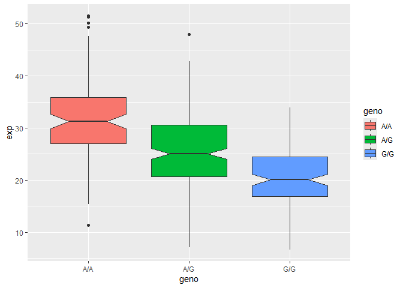

# lab12hw
Nicholas Chiu

## Section 4: Population Scale Analysis

## Q13

``` r
link <- "https://bioboot.github.io/bggn213_W19/class-material/rs8067378_ENSG00000172057.6.txt"

expr <- read.table(link)
head(expr)
```

       sample geno      exp
    1 HG00367  A/G 28.96038
    2 NA20768  A/G 20.24449
    3 HG00361  A/A 31.32628
    4 HG00135  A/A 34.11169
    5 NA18870  G/G 18.25141
    6 NA11993  A/A 32.89721

``` r
dim(expr)
```

    [1] 462   3

``` r
table(expr$geno)
```


    A/A A/G G/G 
    108 233 121 

``` r
median(expr$exp[expr$geno == "A/A"])
```

    [1] 31.24847

``` r
median(expr$exp[expr$geno == "A/G"])
```

    [1] 25.06486

``` r
median(expr$exp[expr$geno == "G/G"])
```

    [1] 20.07363

Q13: Sample size: 108 A/A, 233 A/G, 121 G/G Median expression: 31.25
A/A, 25.06 A/G, 20.07 G/G

## Q14

``` r
## Make boxplot

library(ggplot2)
ggplot(expr) + aes(geno, exp, fill = geno) + geom_boxplot(notch=T)
```



Q14: Based on the generated boxplot, we can infer that the difference in
relative expression values between A/A and G/G are significantly
different. That implies that the SNP affects the expression of ORMDL3.
