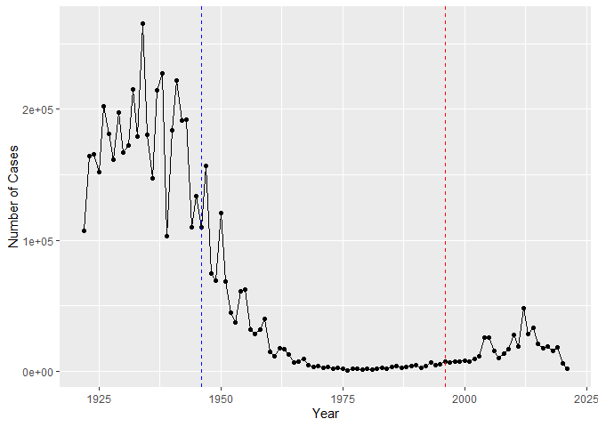

# Lab 18: Pertussis Resurgence
Nicholas Chiu

## Load Package + Data

``` r
library(datapasta)
```

    Warning: package 'datapasta' was built under R version 4.3.3

``` r
library(ggplot2)

cdc <- data.frame(
                                 Year = c(1922L,1923L,1924L,1925L,
                                          1926L,1927L,1928L,1929L,1930L,1931L,
                                          1932L,1933L,1934L,1935L,1936L,
                                          1937L,1938L,1939L,1940L,1941L,1942L,
                                          1943L,1944L,1945L,1946L,1947L,
                                          1948L,1949L,1950L,1951L,1952L,
                                          1953L,1954L,1955L,1956L,1957L,1958L,
                                          1959L,1960L,1961L,1962L,1963L,
                                          1964L,1965L,1966L,1967L,1968L,1969L,
                                          1970L,1971L,1972L,1973L,1974L,
                                          1975L,1976L,1977L,1978L,1979L,1980L,
                                          1981L,1982L,1983L,1984L,1985L,
                                          1986L,1987L,1988L,1989L,1990L,
                                          1991L,1992L,1993L,1994L,1995L,1996L,
                                          1997L,1998L,1999L,2000L,2001L,
                                          2002L,2003L,2004L,2005L,2006L,2007L,
                                          2008L,2009L,2010L,2011L,2012L,
                                          2013L,2014L,2015L,2016L,2017L,2018L,
                                          2019L,2020L,2021L),
         No..Reported.Pertussis.Cases = c(107473,164191,165418,152003,
                                          202210,181411,161799,197371,
                                          166914,172559,215343,179135,265269,
                                          180518,147237,214652,227319,103188,
                                          183866,222202,191383,191890,109873,
                                          133792,109860,156517,74715,69479,
                                          120718,68687,45030,37129,60886,
                                          62786,31732,28295,32148,40005,
                                          14809,11468,17749,17135,13005,6799,
                                          7717,9718,4810,3285,4249,3036,
                                          3287,1759,2402,1738,1010,2177,2063,
                                          1623,1730,1248,1895,2463,2276,
                                          3589,4195,2823,3450,4157,4570,
                                          2719,4083,6586,4617,5137,7796,6564,
                                          7405,7298,7867,7580,9771,11647,
                                          25827,25616,15632,10454,13278,
                                          16858,27550,18719,48277,28639,32971,
                                          20762,17972,18975,15609,18617,
                                          6124,2116)
       )

summary(cdc)
```

          Year      No..Reported.Pertussis.Cases
     Min.   :1922   Min.   :  1010              
     1st Qu.:1947   1st Qu.:  4605              
     Median :1972   Median : 17442              
     Mean   :1972   Mean   : 57903              
     3rd Qu.:1996   3rd Qu.:108070              
     Max.   :2021   Max.   :265269              

## 1. Investigating pertussis cases by year

Q1:

``` r
caseByYearPlot <- ggplot(cdc) +
  aes(Year, No..Reported.Pertussis.Cases) +
  geom_point() +
  geom_line() +
  labs("Pertussis Cases by Year") + ylab("Number of Cases")

caseByYearPlot
```


## 2. A tale of two vaccines (wP & aP)

Q2:

``` r
caseByYearPlot + geom_vline(xintercept = c(1946,1996), linetype="dashed", color = c("blue","red"))
```



Q3: After the introduction of the aP vaccine, cases increased again
starting around the 2000s but decreased again 20 years after. One
possible explanation for the observed trend is that there are less
people who are getting the vaccine compared to before. The sensitivity
of the detection of Pertussis could have also increased.

## 3. Exploring CMI-PB data

``` r
# Allows us to read, write and process JSON data
library(jsonlite)

subject <- read_json("https://www.cmi-pb.org/api/subject", simplifyVector = TRUE) 

head(subject, 3)
```

      subject_id infancy_vac biological_sex              ethnicity  race
    1          1          wP         Female Not Hispanic or Latino White
    2          2          wP         Female Not Hispanic or Latino White
    3          3          wP         Female                Unknown White
      year_of_birth date_of_boost      dataset
    1    1986-01-01    2016-09-12 2020_dataset
    2    1968-01-01    2019-01-28 2020_dataset
    3    1983-01-01    2016-10-10 2020_dataset

``` r
table(subject$infancy_vac)
```


    aP wP 
    60 58 

``` r
table(subject$biological_sex)
```


    Female   Male 
        79     39 

``` r
table(subject$biological_sex, subject$race)
```

            
             American Indian/Alaska Native Asian Black or African American
      Female                             0    21                         2
      Male                               1    11                         0
            
             More Than One Race Native Hawaiian or Other Pacific Islander
      Female                  9                                         1
      Male                    2                                         1
            
             Unknown or Not Reported White
      Female                      11    35
      Male                         4    20

Q4: There are 58 wP and 60 aP infancy vaccinated subjects in the
dataset.

Q5: 79 female and 39 male subjects.

Q6:

0 American Indian/Alaska Native Female, 1 American Indian/Alaska Native
Male

21 Asian Female11 Asian Male

2 Black Female, 0 Black Male

9 More Than One Race Female, 2 More Than One Race Male

1 Native Hawaiian or Other Pacific Islander Female, 1 Native Hawaiian or
Other Pacific Islander Male

11 Unknown or Not Reported Female, 4 Unknown or Not Reported Male

35 White Female, 20 White Male

Q7:

From the tables alone, the age groups appear to be significantly
different

``` r
#install.packages("lubridate")
library(lubridate)
```

    Warning: package 'lubridate' was built under R version 4.3.3


    Attaching package: 'lubridate'

    The following objects are masked from 'package:base':

        date, intersect, setdiff, union

``` r
subject$age <- today() - ymd(subject$year_of_birth)

library(dplyr)
```


    Attaching package: 'dplyr'

    The following objects are masked from 'package:stats':

        filter, lag

    The following objects are masked from 'package:base':

        intersect, setdiff, setequal, union

``` r
ap <- subject %>% filter(infancy_vac == "aP")

round( summary( time_length( ap$age, "years" ) ) )
```

       Min. 1st Qu.  Median    Mean 3rd Qu.    Max. 
         21      26      26      26      27      30 

``` r
wp <- subject %>% filter(infancy_vac == "wP")

round( summary( time_length( wp$age, "years" ) ) )
```

       Min. 1st Qu.  Median    Mean 3rd Qu.    Max. 
         28      31      36      37      39      56 

Q8:

``` r
int <- ymd(subject$date_of_boost) - ymd(subject$year_of_birth)
age_at_boost <- time_length(int, "year")
head(age_at_boost)
```

    [1] 30.69678 51.07461 33.77413 28.65982 25.65914 28.77481

Q9:

These two groups are significantly different.

``` r
ggplot(subject) +
  aes(time_length(age, "year"),
      fill=as.factor(infancy_vac)) +
  geom_histogram(show.legend=FALSE) +
  facet_wrap(vars(infancy_vac), nrow=2) +
  xlab("Age in years")
```

    `stat_bin()` using `bins = 30`. Pick better value with `binwidth`.


``` r
library(dplyr)

specimen <- read_json("https://www.cmi-pb.org/api/specimen", simplifyVector = TRUE) 
titer <- read_json("https://www.cmi-pb.org/api/v4/plasma_ab_titer", simplifyVector = TRUE) 
```

Q9.2:

``` r
meta <- inner_join(specimen, subject)
```

    Joining with `by = join_by(subject_id)`

``` r
dim(meta)
```

    [1] 939  14

``` r
head(meta)
```

      specimen_id subject_id actual_day_relative_to_boost
    1           1          1                           -3
    2           2          1                            1
    3           3          1                            3
    4           4          1                            7
    5           5          1                           11
    6           6          1                           32
      planned_day_relative_to_boost specimen_type visit infancy_vac biological_sex
    1                             0         Blood     1          wP         Female
    2                             1         Blood     2          wP         Female
    3                             3         Blood     3          wP         Female
    4                             7         Blood     4          wP         Female
    5                            14         Blood     5          wP         Female
    6                            30         Blood     6          wP         Female
                   ethnicity  race year_of_birth date_of_boost      dataset
    1 Not Hispanic or Latino White    1986-01-01    2016-09-12 2020_dataset
    2 Not Hispanic or Latino White    1986-01-01    2016-09-12 2020_dataset
    3 Not Hispanic or Latino White    1986-01-01    2016-09-12 2020_dataset
    4 Not Hispanic or Latino White    1986-01-01    2016-09-12 2020_dataset
    5 Not Hispanic or Latino White    1986-01-01    2016-09-12 2020_dataset
    6 Not Hispanic or Latino White    1986-01-01    2016-09-12 2020_dataset
             age
    1 13954 days
    2 13954 days
    3 13954 days
    4 13954 days
    5 13954 days
    6 13954 days

Q10:

``` r
abdata <- inner_join(titer, meta)
```

    Joining with `by = join_by(specimen_id)`

``` r
dim(abdata)
```

    [1] 41775    21

Q11:

``` r
table(abdata$isotype)
```


     IgE  IgG IgG1 IgG2 IgG3 IgG4 
    6698 3233 7961 7961 7961 7961 

Q12:

31520, 8085, 2170

The number of rows for the most recent dataset is much smaller than the
previous 2.

``` r
table(abdata$dataset)
```


    2020_dataset 2021_dataset 2022_dataset 
           31520         8085         2170 

## 4. Examine IgG Ab titer levels

``` r
igg <- abdata %>% filter(isotype == "IgG")
head(igg)
```

      specimen_id isotype is_antigen_specific antigen        MFI MFI_normalised
    1           1     IgG                TRUE      PT   68.56614       3.736992
    2           1     IgG                TRUE     PRN  332.12718       2.602350
    3           1     IgG                TRUE     FHA 1887.12263      34.050956
    4          19     IgG                TRUE      PT   20.11607       1.096366
    5          19     IgG                TRUE     PRN  976.67419       7.652635
    6          19     IgG                TRUE     FHA   60.76626       1.096457
       unit lower_limit_of_detection subject_id actual_day_relative_to_boost
    1 IU/ML                 0.530000          1                           -3
    2 IU/ML                 6.205949          1                           -3
    3 IU/ML                 4.679535          1                           -3
    4 IU/ML                 0.530000          3                           -3
    5 IU/ML                 6.205949          3                           -3
    6 IU/ML                 4.679535          3                           -3
      planned_day_relative_to_boost specimen_type visit infancy_vac biological_sex
    1                             0         Blood     1          wP         Female
    2                             0         Blood     1          wP         Female
    3                             0         Blood     1          wP         Female
    4                             0         Blood     1          wP         Female
    5                             0         Blood     1          wP         Female
    6                             0         Blood     1          wP         Female
                   ethnicity  race year_of_birth date_of_boost      dataset
    1 Not Hispanic or Latino White    1986-01-01    2016-09-12 2020_dataset
    2 Not Hispanic or Latino White    1986-01-01    2016-09-12 2020_dataset
    3 Not Hispanic or Latino White    1986-01-01    2016-09-12 2020_dataset
    4                Unknown White    1983-01-01    2016-10-10 2020_dataset
    5                Unknown White    1983-01-01    2016-10-10 2020_dataset
    6                Unknown White    1983-01-01    2016-10-10 2020_dataset
             age
    1 13954 days
    2 13954 days
    3 13954 days
    4 15050 days
    5 15050 days
    6 15050 days

Q13:

``` r
ggplot(igg) +
  aes(MFI_normalised, antigen) +
  geom_boxplot() + 
    xlim(0,75) +
  facet_wrap(vars(visit), nrow=2)
```

    Warning: Removed 5 rows containing non-finite outside the scale range
    (`stat_boxplot()`).


Q14: PT, PRN, FIM2/3, and FHA show differences in the level of IgG
antibody titers recognizing them over time. This is likely because they
are involved in active infection and virulence as well as cell binding.

``` r
ggplot(igg) +
  aes(MFI_normalised, antigen, col=infancy_vac ) +
  geom_boxplot(show.legend = FALSE) + 
  facet_wrap(vars(visit), nrow=2) +
  xlim(0,75) +
  theme_bw()
```

    Warning: Removed 5 rows containing non-finite outside the scale range
    (`stat_boxplot()`).


``` r
igg %>% filter(visit != 8) %>%
ggplot() +
  aes(MFI_normalised, antigen, col=infancy_vac ) +
  geom_boxplot(show.legend = FALSE) + 
  xlim(0,75) +
  facet_wrap(vars(infancy_vac, visit), nrow=2)
```

    Warning: Removed 5 rows containing non-finite outside the scale range
    (`stat_boxplot()`).


Q15:

``` r
filter(igg, antigen=="OVA") %>%
  ggplot() +
  aes(MFI_normalised, col=infancy_vac) +
  geom_boxplot(show.legend = F) +
  facet_wrap(vars(visit)) +
  theme_bw() +
  labs(title="OVA antigen levels per visit (aP red, wP teal)")
```


``` r
filter(igg, antigen=="PT") %>%
  ggplot() +
  aes(MFI_normalised, col=infancy_vac) +
  geom_boxplot(show.legend = F) +
  facet_wrap(vars(visit)) +
  theme_bw() +
  labs(title="PT antigen levels per visit (aP red, wP teal)")
```


Q16:

PT levels increase over time and are much larger than OVA antigen
levels. PT levels for both vaccines peaks around the fifth visit and
declines while the OVA levels stay relatively constant in comparison.

Q17: When looking at the PT antigen levels, there does not appear to be
an extremely significant difference between the two vaccines. From
visits 4-6, aP does have a higher median antigen level but not
significantly.

``` r
abdata.21 <- abdata %>% filter(dataset == "2021_dataset")

abdata.21 %>% 
  filter(isotype == "IgG",  antigen == "PT") %>%
  ggplot() +
    aes(x=planned_day_relative_to_boost,
        y=MFI_normalised,
        col=infancy_vac,
        group=subject_id) +
    geom_point() +
    geom_line() +
    geom_vline(xintercept=0, linetype="dashed") +
    geom_vline(xintercept=14, linetype="dashed") +
  labs(title="2021 dataset IgG PT",
       subtitle = "Dashed lines indicate day 0 (pre-boost) and 14 (apparent peak levels)")
```


``` r
abdata.20 <- abdata %>% filter(dataset == "2020_dataset" & planned_day_relative_to_boost<200)
abdata.20 %>% 
  filter(isotype == "IgG",  antigen == "PT") %>%
  ggplot() +
    aes(x=planned_day_relative_to_boost,
        y=MFI_normalised,
        col=infancy_vac,
        group=subject_id) +
    geom_point() +
    geom_line() +
    geom_vline(xintercept=0, linetype="dashed") +
    geom_vline(xintercept=14, linetype="dashed") +
  labs(title="2020 dataset IgG PT",
       subtitle = "Dashed lines indicate day 0 (pre-boost) and 14 (apparent peak levels)")
```


Q18:

The 2020 dataset displays a similar trend to the 2021 dataset.

## 5. Obtaining CMI-PB RNASeq data

``` r
url <- "https://www.cmi-pb.org/api/v2/rnaseq?versioned_ensembl_gene_id=eq.ENSG00000211896.7"

rna <- read_json(url, simplifyVector = TRUE) 
```

``` r
#meta <- inner_join(specimen, subject)
ssrna <- inner_join(rna, meta)
```

    Joining with `by = join_by(specimen_id)`

Q19:

``` r
ggplot(ssrna) +
  aes(visit, tpm, group=subject_id) +
  geom_point() +
  geom_line(alpha=0.2)
```


Q20:

IGHG1 gene expression increases over time, with a distict peak at visit
4, before decreasing.

Q21:

This pattern does match the trend of ab titer data. At around visit 5 is
when antigen levels peak, which is right after the gene is most strongly
expressed. Since antigens are long-lived, the levels of antigens remains
high while the gene expression decreases.

``` r
ggplot(ssrna) +
  aes(tpm, col=infancy_vac) +
  geom_boxplot() +
  facet_wrap(vars(visit))
```


``` r
ssrna %>%  
  filter(visit==4) %>% 
  ggplot() +
    aes(tpm, col=infancy_vac) + geom_density() + 
    geom_rug() 
```


